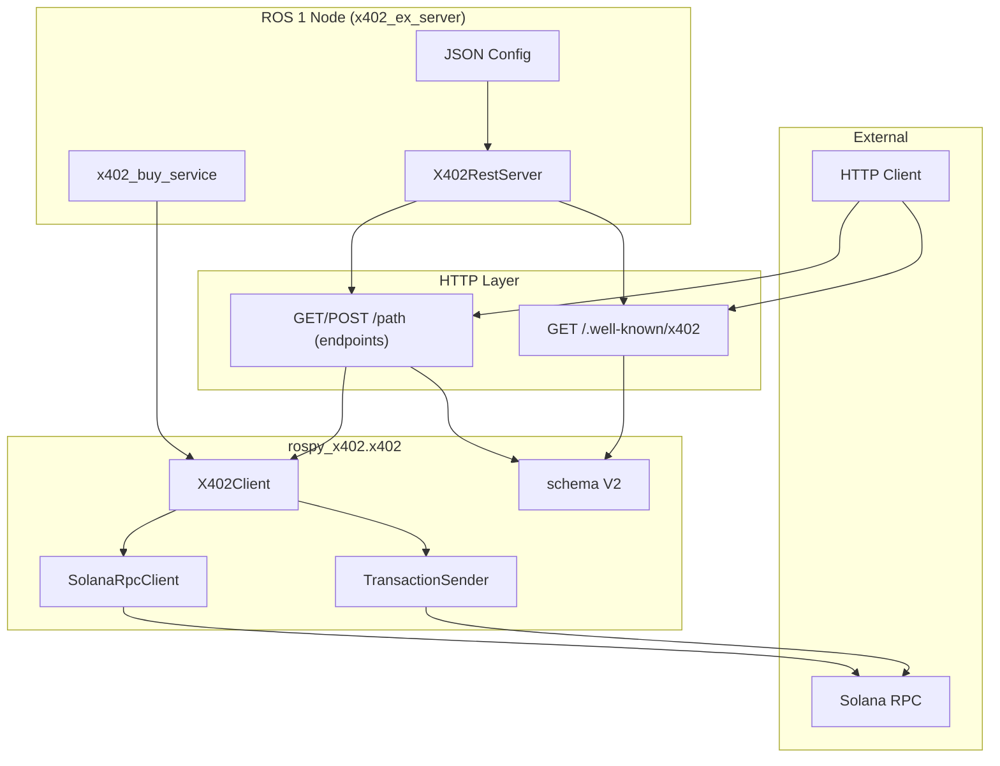
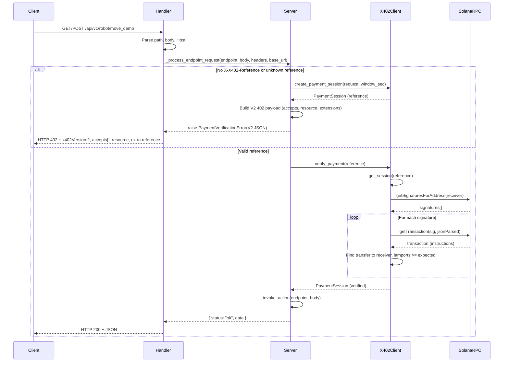
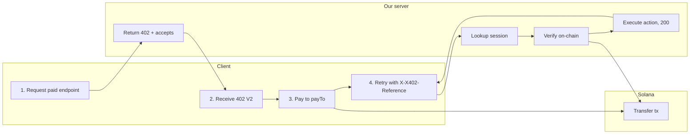
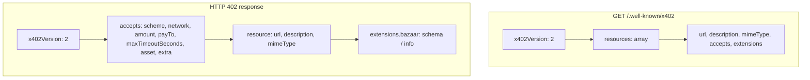

# Architecture and x402 flow (Mermaid)

This file contains Mermaid diagrams for (A) node architecture and (B) x402 protocol implementation including payment verification. Use these as the reference for how the node works and how payments are verified.

---

## A. Node architecture (x402_ex_server)



---

## A.2 Request flow inside the node (paid endpoint)



---

## B. x402 protocol implementation (overview)



---

## B.2 Payment verification (detail)

How we verify that the client has paid: **on-chain only** (no facilitator in the default path).

```mermaid
flowchart TD
    A[verify_payment(reference)] --> B{Session exists?}
    B -->|No| C[Raise PaymentVerificationError]
    B -->|Yes| D{Session expired?}
    D -->|Yes| E[Raise PaymentTimeoutError]
    D -->|No| F[Compute expected_lamports from session.request.amount]
    F --> G[getSignaturesForAddress(receiver, limit=200)]
    G --> H[For each signature]
    H --> I[getTransaction(signature, encoding=jsonParsed)]
    I --> J{result.meta.err?}
    J -->|Set| H
    J -->|null| K[Parse transaction.message.instructions]
    K --> L{parsed.type == "transfer" && info.destination == receiver && lamports >= expected?}
    L -->|No| H
    L -->|Yes| M[Store signature on session, return session]
```

- **Data source**: Solana RPC `getSignaturesForAddress` + `getTransaction` with `encoding: "jsonParsed"`.
- **Match criteria**: An instruction with `parsed.type === "transfer"`, `parsed.info.destination === receiver`, and `parsed.info.lamports >= expected_lamports`.
- **Commitment**: We use `"confirmed"` for both RPC calls (configurable in code if needed).
- **Caching**: Short TTL cache for signature list per receiver to avoid hammering RPC on repeated checks.

---

## B.3 Discovery and 402 response shape (V2)



---

All diagrams reflect the current implementation. When changing payment verification or the x402 exchange schema, update both `X402_PROTOCOL.md` and these diagrams.
