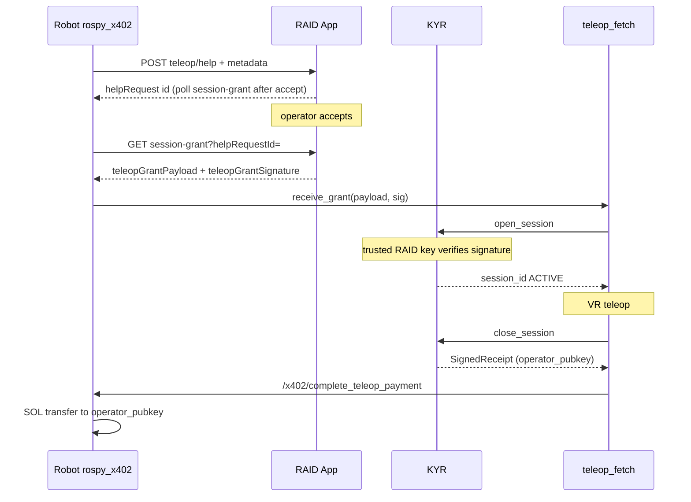

# RAID App — full teleop cycle: `teleop/help`, SessionGrant, operator wallet, post-session SOL (x402)

**Audience:** RAID App team (`x402_raid_app` or equivalent), product and backend.  
**Robot:** package `rospy_x402` (`EscalationManager`, node `x402_ex_server`).  
**Robot developer (step order, KYR, `pending_from_raid`):** [ROBOT_TELEOP_KYR_RAID_GRANT.md](ROBOT_TELEOP_KYR_RAID_GRANT.md).  
**Related:** [RAID_APP_TELEOP_HELP_SPEC.md](RAID_APP_TELEOP_HELP_SPEC.md) (request body), [RAID_INTEGRATION.md](RAID_INTEGRATION.md), [../br-kyr/DOC/ROSBRIDGE_AND_RAID.md](../../br-kyr/DOC/ROSBRIDGE_AND_RAID.md).

## Goal

Close the loop:

1. Robot requests help **only** through RAID: `POST /api/robots/{robotId}/teleop/help` (already implemented).
2. RAID assigns an operator who already has a **Solana public key** in your DB for receiving payment.
3. RAID returns a **signed SessionGrant** (KYR) with `operator_pubkey` in JSON — same Solana base58.
4. After the session KYR closes and puts the same `operator_pubkey` in **SignedReceipt**.
5. Robot sends SOL to the operator using the **same wallet and stack** as `x402_buy_service` (outgoing `X402Client.send_payment`), ROS service `/x402/complete_teleop_payment`.

RAID is **not** required to implement on-chain Solana logic: correct grant + pubkey is enough; transaction signing runs on the robot.

**Payment amount (product alignment):** only the **robot** initiates transfer (`SOLANA_PRIVATE_KEY` / ENV). RAID does not send SOL. Amount on the robot (priority top to bottom):

1. Field **`operator_payment_sol`** in SessionGrant JSON (see §3) — copied into SignedReceipt on `close_session` and **overrides** the rest.
2. Else rosparam **`teleop_operator_payment_flat_sol`** on `x402_server` (`br_bringup/ecosystem.launch` default **0.0005** SOL per session — duration-independent).
3. Else `(ended_at - started_at) * teleop_operator_payment_sol_per_sec`.

For a pilot you can **leave RAID amount unchanged**: grant with `operator_pubkey` is enough; the robot already pays **0.0005 SOL** per completed session. If product wants RAID-driven amount — add numeric **`operator_payment_sol`** to the signed SessionGrant (e.g. `0.0005`).

---

## 1. Request (base contract unchanged)

See [RAID_APP_TELEOP_HELP_SPEC.md](RAID_APP_TELEOP_HELP_SPEC.md): `message`, `metadata.task_id`, `error_context`, `situation_report`, optional `kyr_peaq_context`.

---

## 2. RAID response: request id + signed grant

HTTP **200** or **201**; **401** on bad secret.

**Two-phase issuance (typical for `x402_raid_app`):** right after `POST …/teleop/help` a grant with a **real** `operator_pubkey` may **not exist yet** (operator has not pressed Accept). Then the help response has **`id`** / **`helpRequest.id`** and optionally **`teleopGrantPollUrl`**. Robot (`rospy_x402`) **polls** `GET …/teleop/session-grant?helpRequestId=…` until **200** with `teleopGrantPayload` + `teleopGrantSignature` or timeout. Details and `404` errors (`grant_not_ready`, `grant_unconfigured`, `grant_absent`): [ROBOT_TELEOP_KYR_RAID_GRANT.md](ROBOT_TELEOP_KYR_RAID_GRANT.md).

### 2.1 Fields required for the full cycle

The robot looks for the grant at JSON root or inside `helpRequest` / `help_request` (nested object merged with root for field lookup).

**Option A (preferred): ready signature string**

| Field | Type | Description |
|------|------|-------------|
| `teleopGrantPayload` | string | Exact UTF-8 JSON **SessionGrant** string, byte-for-byte as signed. Robot passes to KYR without re-serializing. |
| `teleopGrantSignature` | string | Ed25519 signature in **base58** over **raw UTF-8 bytes** of `teleopGrantPayload`. |

**Key synonyms (robot accepts any):**

- payload: `teleopGrantPayload`, `grantPayload`, `sessionGrantPayload`
- signature: `teleopGrantSignature`, `grantSignature`, `sessionGrantSignature`

**Option B: object + signature**

| Field | Type | Description |
|------|------|-------------|
| `sessionGrant` (or `session_grant`) | object | SessionGrant object (see §3). |
| One of the signature keys above | string | Signature over canonical JSON: `json.dumps(obj, sort_keys=True, separators=(',', ':'))`, UTF-8, `ensure_ascii=False` for Unicode. |

Option B is worse for compatibility: any serialization mismatch breaks KYR verification. Option A is safer.

### 2.2 Compatibility with older robots

If there is no signed grant, the robot stays on **fallback**: local mock SessionGrant and `operator_pubkey: "pending_from_raid"` — operator payment is skipped until a real pubkey appears in the receipt.

### 2.3 Recommended extra fields

- `id` or `helpRequest.id` — as today, for Peaq claim and tracking.
- `duplicate: true` on duplicate delivery of the same request — as today.

### 2.4 When the operator is assigned (RAID App behavior)

In current RAID the operator is fixed only after **`POST /api/teleoperator/help-requests/{id}/accept`**. The **signed grant** is usually **not** in the first **`POST …/teleop/help`** response: the robot polls **`GET /api/robots/{robotId}/teleop/session-grant?helpRequestId=`** (same **`X-Robot-Teleop-Secret`**) until **`teleopGrantPayload`** / **`teleopGrantSignature`**, or uses §2.2 fallback while the request is open or signing is unconfigured.

**Payment fields on the robot:** payout amount is determined only from the **signed SessionGrant / SignedReceipt** and **`x402_server` rosparams** — see the **Payment amount** bullets at the top of this document. In particular, **`operator_payment_sol`** in the SessionGrant (optional) is copied into the receipt and overrides flat and per-second rules.

**`scope_json` hints (RAID-only convention):** RAID MAY embed **`teleop_payment_mode`**: **`flat`**, **`teleop_operator_flat_sol`** (e.g. aligned with env **`TELEOP_OPERATOR_FLAT_SOL`**) inside **`scope_json`** for UI or other consumers. **`rospy_x402` does not read those keys**; to steer the robot payout from RAID, set numeric **`operator_payment_sol`** on the grant or rely on operator defaults in launch (`teleop_operator_payment_flat_sol`, `teleop_operator_payment_sol_per_sec`).

### 2.5 Operator lifecycle on RAID (grant invalidation and HTTP end)

- **`POST /api/teleoperator/sessions/{sessionId}/decline-before-connect`** (operator JWT): allowed only **before** the operator opens **`/ws/teleop/session/{sessionId}`** (RAID has not set **`robot_proxy_connected_at`**). RAID ends the teleop session row, returns the help request to **`open`**, clears **`teleop_grant_payload` / `teleop_grant_signature`**, and excludes that operator from seeing this help request again. The robot’s poller will get **`grant_not_ready`** again — it must **discard any cached SessionGrant** and wait for **200** after the next accept. See [ROBOT_TELEOP_KYR_RAID_GRANT.md](ROBOT_TELEOP_KYR_RAID_GRANT.md) §4.3 and §4.4.
- **`POST /api/teleoperator/sessions/{sessionId}/end`** with body **`{ "reason": "<enum>" }`** (same JWT): allowed after the proxy path has connected (**`robot_proxy_connected_at`** set). RAID closes the help request and stores **`operator_end_reason`**; it may close the operator WebSocket. **SOL settlement** (full / partial / none vs. reason) remains on the **robot**: KYR **`close_session`**, receipt, **`/x402/complete_teleop_payment`**. VR and robot session teardown: [../br-vr-dev-sinc/DOC/TELEOP_SESSION_LIFECYCLE_AND_FAILURES.md](../br-vr-dev-sinc/DOC/TELEOP_SESSION_LIFECYCLE_AND_FAILURES.md).

---

## 3. SessionGrant schema (JSON inside `teleopGrantPayload`)

Fields expected by KYR (`session_module.open_session`):

| Field | Type | Description |
|------|------|-------------|
| `session_id` | string | Unique session id (UUID or help request id). |
| `robot_id` | string | Robot UUID from enroll (as in `raid_robot_state.json`). |
| `task_id` | string | Copy/link to `metadata.task_id` from the request. |
| `operator_pubkey` | string | **Solana public key base58** for the operator who will receive SOL. Must match your DB. |
| `valid_until_sec` | number | Grant expiry Unix time. |
| `scope_json` | string | JSON string for policy, e.g. `{"allowed_actions":["*"]}`. |
| `operator_payment_sol` | number, **optional** | Fixed SOL for this session (copied to receipt, highest priority for `/x402/complete_teleop_payment`). Pilot example: `0.0005`. If omitted — robot uses `teleop_operator_payment_flat_sol` or per-second rate. |

The grant is signed by a **RAID Ed25519 key**, not the operator wallet. The issuer public key must be configured on the robot in `~trusted_raid_keys`.

**Important:** `operator_pubkey` is the SOL recipient; grant signing key is a separate RAID trust key.

---

## 4. Post-payment on the robot (for RAID / support)

After `POST …/teleop/help` and KYR session open, the operator uses the existing teleop pipeline. **Payment and grant close are not tied to “leaving RAID UI” alone** — **`close_session`** must run on the robot.

### 4.1 Who triggers session close

| Method | Description |
|--------|-------------|
| **ROS service** | **`/teleop_fetch/end_session`** (`teleop_fetch/EndSession`), `reason` free text. Prefer calling from **RAID** when the operator clicks “end help” via **rosbridge** (same channel as teleop). Until this runs, KYR session stays **ACTIVE**, **payment does not start**. |
| **Second L_Y on headset** | If **`~end_session_on_second_ly`** is enabled (default `true` in `teleop.yaml`): first **L_Y** only disarms (arm stream stops, KYR still **ACTIVE**); **second L_Y** (after the first) closes session and starts payment. |

A single **L_Y** does **not** close the grant — intentional split between “pause stream” and “end session with billing”.

After one of the triggers fires:

1. `teleop_fetch` calls KYR `close_session`.
2. Then ROS **`/x402/complete_teleop_payment`** with `receipt_payload` from KYR.
3. Node picks amount per priority in the introduction (receipt.`operator_payment_sol` → flat → duration × rate).
4. Outgoing SOL transfer to `operator_pubkey` from receipt (same stack as `x402_buy_service` with `payer_account` set).

Optionally RAID may later accept payment notifications from the robot (separate endpoint — not part of the mandatory contract today); commented example exists for `POST …/receipt`.

---

## 5. Flow (short)



---

## 6. RAID checklist

0. Set **`TELEOP_GRANT_SIGNING_SECRET_KEY`** in RAID (separate Solana keypair for grant signing; not the robot payer wallet). Else **`GET …/teleop/session-grant`** may return **`grant_unconfigured`** and the robot stays on the mock grant (§2.2).
1. Store and inject operator **Solana base58** from DB into the grant.
2. Issue a **signed** grant (option A or B).
3. Publish the grant signer **Ed25519 public key** for KYR `trusted_raid_keys` (in production **`GET /health`** → **`teleopGrantSignerPublicKey`**).
4. Persist `situation_report` and request context for operator UI/API ([RAID_APP_TELEOP_HELP_SPEC.md](RAID_APP_TELEOP_HELP_SPEC.md)).
5. On “end help”, call rosbridge service **`/teleop_fetch/end_session`** with a meaningful `reason` (otherwise billing may not run if the operator does not double-tap L_Y on Quest).

After RAID implements this, the robot stops using the mock grant for those responses and can pay the operator in SOL when the session ends.

---

## 7. Troubleshooting: `pending_from_raid` in receipt / “NO on-chain transfer”

Messages like **`No valid operator Solana pubkey in receipt`** / **`pending_from_raid`** mean **KYR did not record a real `operator_pubkey` from RAID’s signed grant** in **SignedReceipt**. It **does not** mean RAID sends stale data in `POST …/teleop/help`: that response often has no grant yet (no operator).

**Typical causes:**

1. **Step order on robot:** KYR `open_session` ran with a **mock grant** before the robot finished **`GET …/teleop/session-grant`** after operator **accept**. Fix: after polling obtains **`teleopGrantPayload`** + **`teleopGrantSignature`**, pass them to KYR **`open_session`**, then teleop.
2. **Grant signature not trusted on KYR:** RAID signer pubkey must be in **`trusted_raid_keys`** on the robot. Compare **`GET /health`** on RAID → **`teleopGrantSignerPublicKey`**, or **`grantSignerPublicKey`** in **`GET …/teleop/session-grant`**. Without this KYR may reject the grant and stay on fallback.
3. **`grant_absent` on RAID:** operator has empty **`wallet_public_key`** in DB — grant is not signed.

**Check from a workstation** (substitute `robotId`, secret, `helpRequestId` after accept):

```bash
curl -sS -H "X-Robot-Teleop-Secret: <secret>" \
  "https://<raid-host>/api/robots/<robotId>/teleop/session-grant?helpRequestId=<uuid>"
```

Parsed **`teleopGrantPayload`** must contain **`operator_pubkey`** as operator base58 wallet (not `pending_from_raid`).

When grant signing is configured, **`POST …/teleop/help`** may include **`teleopGrantPollUrl`** — relative path ready for polling after accept.
