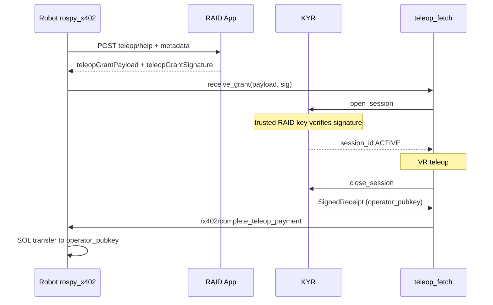

# RAID App — полный цикл телеопа: `teleop/help`, SessionGrant, кошелёк оператора, пост-оплата SOL (x402)

**Аудитория:** команда RAID App (`x402_raid_app` или эквивалент), продукт и бэкенд.  
**Робот:** пакет `rospy_x402` (`EscalationManager`, нода `x402_ex_server`).  
**Связанные документы:** [RAID_APP_TELEOP_HELP_SPEC.md](RAID_APP_TELEOP_HELP_SPEC.md) (тело запроса), [RAID_INTEGRATION.md](RAID_INTEGRATION.md), [../br-kyr/DOC/ROSBRIDGE_AND_RAID.md](../../br-kyr/DOC/ROSBRIDGE_AND_RAID.md).

## Цель

Замкнуть цепочку:

1. Робот запрашивает помощь **только** через RAID: `POST /api/robots/{robotId}/teleop/help` (уже реализовано).
2. RAID назначает оператора, у которого в вашей БД уже есть **публичный ключ Solana** для приёма оплаты.
3. RAID возвращает роботу **подписанный SessionGrant** (KYR), где в JSON указан `operator_pubkey` — тот же Solana base58.
4. После сессии KYR закрывает сессию и кладёт тот же `operator_pubkey` в **SignedReceipt**.
5. Робот переводит SOL оператору через **тот же кошелёк и стек**, что и сервис `x402_buy_service` (исходящий перевод `X402Client.send_payment`), сервис ROS `/x402/complete_teleop_payment`.

RAID **не** обязан реализовывать on-chain логику Solana: достаточно отдавать корректный грант и pubkey; подпись транзакции выполняется на роботе.

**Сумма оплаты (важно для продуктовых договорённостей):** перевод инициирует **только робот** (ключ из `SOLANA_PRIVATE_KEY` / ENV). RAID не шлёт SOL. Сумма на роботе задаётся так (приоритет сверху вниз):

1. Поле **`operator_payment_sol`** в JSON SessionGrant (см. §3) — попадает в SignedReceipt при `close_session` и **перекрывает** остальное.
2. Иначе rosparam **`teleop_operator_payment_flat_sol`** на `x402_server` (в `br_bringup/ecosystem.launch` по умолчанию **0.0005** SOL за сессию — не зависит от длительности).
3. Иначе `(ended_at - started_at) * teleop_operator_payment_sol_per_sec`.

Для пилота можно **ничего не менять в сумме на стороне RAID**: достаточно гранта с `operator_pubkey`; робот уже платит **0.0005 SOL** за завершённую сессию. Если продукт хочет задавать сумму с RAID — добавьте в подписываемый SessionGrant числовое поле **`operator_payment_sol`** (например `0.0005`).

---

## 1. Запрос (без изменений базового контракта)

См. [RAID_APP_TELEOP_HELP_SPEC.md](RAID_APP_TELEOP_HELP_SPEC.md): `message`, `metadata.task_id`, `error_context`, `situation_report`, опционально `kyr_peaq_context`.

---

## 2. Ответ RAID: идентификация заявки + подписанный грант

HTTP **200** или **201**; **401** при неверном секрете.

### 2.1 Обязательные для полного цикла поля

Робот ищет грант в корне JSON или внутри `helpRequest` / `help_request` (вложенный объект сливается с корнем для поиска полей).

**Вариант A (предпочтительный): готовая строка подписи**

| Поле | Тип | Описание |
|------|-----|----------|
| `teleopGrantPayload` | string | Точная UTF-8 строка JSON **SessionGrant**, байт-в-байт как подписывали. Робот передаёт её в KYR без пересборки JSON. |
| `teleopGrantSignature` | string | Подпись Ed25519 в **base58** над **сырыми UTF-8 байтами** `teleopGrantPayload`. |

**Синонимы ключей (робот принимает любой из списка):**

- payload: `teleopGrantPayload`, `grantPayload`, `sessionGrantPayload`
- signature: `teleopGrantSignature`, `grantSignature`, `sessionGrantSignature`

**Вариант B: объект + подпись**

| Поле | Тип | Описание |
|------|-----|----------|
| `sessionGrant` (или `session_grant`) | object | Объект SessionGrant (см. §3). |
| Один из ключей подписи выше | string | Подпись **именно** над каноническим JSON: `json.dumps(obj, sort_keys=True, separators=(',', ':'))`, UTF-8, `ensure_ascii=False` по смыслу Unicode. |

Вариант B хуже для совместимости: любое расхождение в сериализации сломает проверку на KYR. Вариант A надёжнее.

### 2.2 Совместимость со старыми роботами

Если подписанного гранта нет, робот остаётся на **фолбэке**: локальный mock SessionGrant и `operator_pubkey: "pending_from_raid"` — оплата оператору будет пропущена до появления реального pubkey в receipt.

### 2.3 Рекомендуемые дополнительные поля

- `id` или `helpRequest.id` — как сейчас, для Peaq claim и трекинга.
- `duplicate: true` при повторной доставке той же заявки — как сейчас.

---

## 3. Схема SessionGrant (JSON внутри `teleopGrantPayload`)

Поля, которые ожидает KYR (`session_module.open_session`):

| Поле | Тип | Описание |
|------|-----|----------|
| `session_id` | string | Уникальный id сессии (можно UUID или id заявки help). |
| `robot_id` | string | UUID робота из enroll (как у робота в `raid_robot_state.json`). |
| `task_id` | string | Копия/связь с `metadata.task_id` из запроса. |
| `operator_pubkey` | string | **Solana public key base58** оператора, которому потом уйдёт SOL. Должен совпадать с данными в вашей БД. |
| `valid_until_sec` | number | Unix-время истечения гранта. |
| `scope_json` | string | JSON-строка с политикой, напр. `{"allowed_actions":["*"]}`. |
| `operator_payment_sol` | number, **опционально** | Фиксированная сумма в SOL за эту сессию (попадёт в receipt и в приоритете при `/x402/complete_teleop_payment`). Пример пилота: `0.0005`. Если не задано — на роботе используется `teleop_operator_payment_flat_sol` или поминутная ставка. |

Подписывает грант **ключ RAID (Ed25519)**, не кошелёк оператора. Публичный ключ издателя гранта должен быть внесён в KYR в `~trusted_raid_keys` на роботе.

**Важно:** `operator_pubkey` — это адрес получателя SOL; ключ подписи гранта — отдельный ключ доверия RAID.

---

## 4. Пост-оплата на роботе (для справки RAID / саппорта)

После `POST …/teleop/help` и открытия сессии KYR оператор работает через существующий телеоп-пайплайн. **Оплата и закрытие гранта не привязаны к «выходу из UI» на стороне RAID сами по себе** — на роботе должен выполниться **`close_session`**.

### 4.1 Кто вызывает закрытие сессии (триггер)

| Способ | Описание |
|--------|----------|
| **ROS-сервис** | **`/teleop_fetch/end_session`** (`teleop_fetch/EndSession`), поле `reason` — произвольная строка. Рекомендуется вызывать из **RAID** при нажатии оператором «Завершить помощь» через **rosbridge** (тот же канал, что и телеоп). Пока этот вызов не сделан, сессия в KYR остаётся **ACTIVE**, **оплата не запускается**. |
| **Второе L_Y на шлеме** | Если включено **`~end_session_on_second_ly`** (по умолчанию `true` в `teleop.yaml`): первое **L_Y** только снимает arm (стрим рук останавливается, сессия KYR ещё ACTIVE); **второе L_Y** (после первого) закрывает сессию и запускает цепочку оплаты. |

Одно нажатие **L_Y** **не** закрывает грант — это сознательное разделение «пауза стрима» и «конец сессии с биллингом».

После того как сработал один из триггеров выше:

1. `teleop_fetch` вызывает KYR `close_session`.
2. Затем вызывается ROS-сервис **`/x402/complete_teleop_payment`** с `receipt_payload` от KYR.
3. Нода выбирает сумму по приоритету из введения (receipt.`operator_payment_sol` → flat → длительность × ставка).
4. Выполняется исходящий перевод SOL на `operator_pubkey` из receipt (тот же стек, что и `x402_buy_service` с заполненным `payer_account`).

Опционально RAID может позже принимать от робота уведомление о факте оплаты (отдельный эндпоинт — вне текущего обязательного контракта); в коде робота закомментирован пример `POST …/receipt`.

---

## 5. Поток (кратко)

---

## 6. Чеклист для RAID

1. Хранить и подставлять в грант **Solana base58** оператора из БД.
2. Выдавать **подписанный** грант (вариант A или B).
3. Опубликовать **Ed25519 публичный ключ подписанта** гранта для настройки KYR `trusted_raid_keys`.
4. Сохранять `situation_report` и контекст заявки в UI/API оператора ([RAID_APP_TELEOP_HELP_SPEC.md](RAID_APP_TELEOP_HELP_SPEC.md)).
5. При завершении помощи оператором вызывать по rosbridge сервис **`/teleop_fetch/end_session`** с осмысленным `reason` (иначе биллинг не сработает, если оператор не сделал второе L_Y на Quest).

После внедрения на стороне RAID робот перестаёт использовать mock-грант для этих ответов и сможет платить оператору в SOL по завершении сессии.
